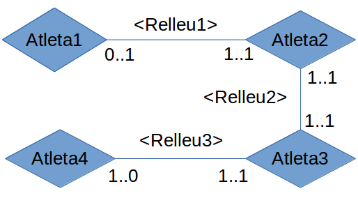

# 1 Modelar en UML
### 1. En una acadèmia els professors fan classe als alumnes matriculats de manera que tot professor fa classe almenys a un alumne i tot alumne rep classe d'un únic professor

### 2. Els professors d'un centre poden ser o no tutors d'un alumne, en qualsevol cas els alumnes solament podran tenir un únic tutor

### 3. En un comerç, un client compra diversos productes, i un producte pot ser comprat per diversos clients

### 4. Representa la relació entre Persones i els seus pares

### 5. En una carrera de relleus, representar la relació donar el relleu entre atletes(per calcular les cardinalidades màxima i mínima hauràs de tenir en compte si es tracta del primer, l'últim o el 2º o 3º)

### 6. Una empresa està composta per diversos departaments dels quals es desitja emmagatzemar la seva nº, nom i localitat. Els empleats han d'estar assignats a un departament i es guardaran les seves dades nºemprat, cognom, salari.A més, cada empleat té un cap (Nota: s'ha suposat que un departament pot no tenir empleats)

### 7. Es desitja construir una bd per mantenir informació sobre els equips i partits de la lliga.  Un equip té un cert nº de jugadors (Aneu_jugador, dades personals) i no tots participen en cada partit. Volem registrar a més per cada partit, quins jugadors juguen, la data i l'hora del partit, resultats de les trobades i les posicions on juguen.

### 8. En una empresa, per a cadascun dels seus empleats, es guarden les dades dels seus fills. Representa aquesta relació fent les suposicions que creguis convenients

### 9. Es desitja dissenyar una BD per a una Universitat que contingui informació sobre carreres i assignatures que es poden estudiar. A més s'inclourà la informació dels alumnes matriculats en les corresponents assignatures i les qualificacions que obtenen en les assignatures en les quals estan matriculats. Nota: suposar que una assignatura solament pot pertànyer a una carrera.

### 10. Exercici: calcula la cardinalitat de la següent relació ternària

# 2 Representar les relacions anteriors amb Visual Paradigm 

### 1. En una acadèmia els professors fan classe als alumnes matriculats de manera que tot professor fa classe almenys a un alumne i tot alumne rep classe d'un únic professor

### 2. Els professors d'un centre poden ser o no tutors d'un alumne, en qualsevol cas els alumnes solament podran tenir un únic tutor

### 3. En un comerç, un client compra diversos productes, i un producte pot ser comprat per diversos clients

### 4. Representa la relació entre Persones i els seus pares

### 5. En una carrera de relleus, representar la relació donar el relleu entre atletes(per calcular les cardinalidades màxima i mínima hauràs de tenir en compte si es tracta del primer, l'últim o el 2º o 3º)

### 6. Una empresa està composta per diversos departaments dels quals es desitja emmagatzemar la seva nº, nom i localitat. Els empleats han d'estar assignats a un departament i es guardaran les seves dades nºemprat, cognom, salari.A més, cada empleat té un cap (Nota: s'ha suposat que un departament pot no tenir empleats)

### 7. Es desitja construir una bd per mantenir informació sobre els equips i partits de la lliga.  Un equip té un cert nº de jugadors (Aneu_jugador, dades personals) i no tots participen en cada partit. Volem registrar a més per cada partit, quins jugadors juguen, la data i l'hora del partit, resultats de les trobades i les posicions on juguen.

### 8. En una empresa, per a cadascun dels seus empleats, es guarden les dades dels seus fills. Representa aquesta relació fent les suposicions que creguis convenients

### 9. Es desitja dissenyar una BD per a una Universitat que contingui informació sobre carreres i assignatures que es poden estudiar. A més s'inclourà la informació dels alumnes matriculats en les corresponents assignatures i les qualificacions que obtenen en les assignatures en les quals estan matriculats. Nota: suposar que una assignatura solament pot pertànyer a una carrera.

### 10. Exercici: calcula la cardinalitat de la següent relació ternària

